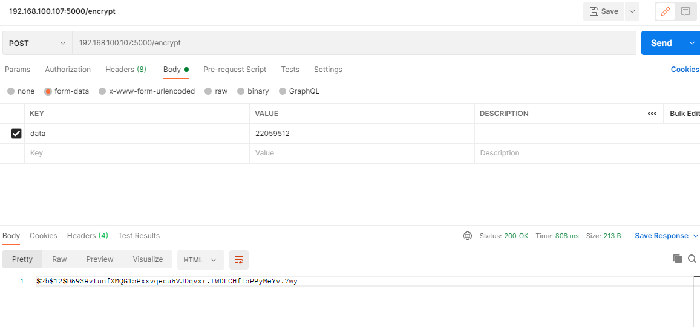
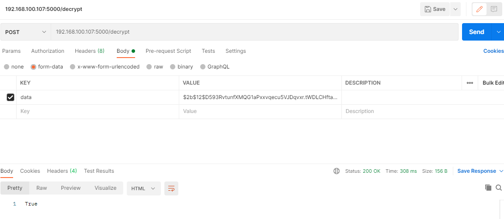

# flask_bcrypt

Because there seems to be some errors in the official documents, a demo that can run normally is implemented here.

### how to use
---
<code>
  conda install --file requirements.txt
</code>
or 
<code>
  pip install -r requirements.txt
</code>

#### encrypt

<code>
  http://{your_ip:port}:encrypt
  
  form-data  
    data:{put_your_key}
</code>

response String -> $2b$12$D593RvtunfXMQG1aPxxvqecu5VJDqvxr.tWDLCHftaPPyMeYv.7wy

  
#### decrypt

<code>
  http://{your_ip:port}:encrypt
  
  form-data。 
    data:{put_your_key}
</code>

response
  String -> True or False 
  
  
License
---
MIT
